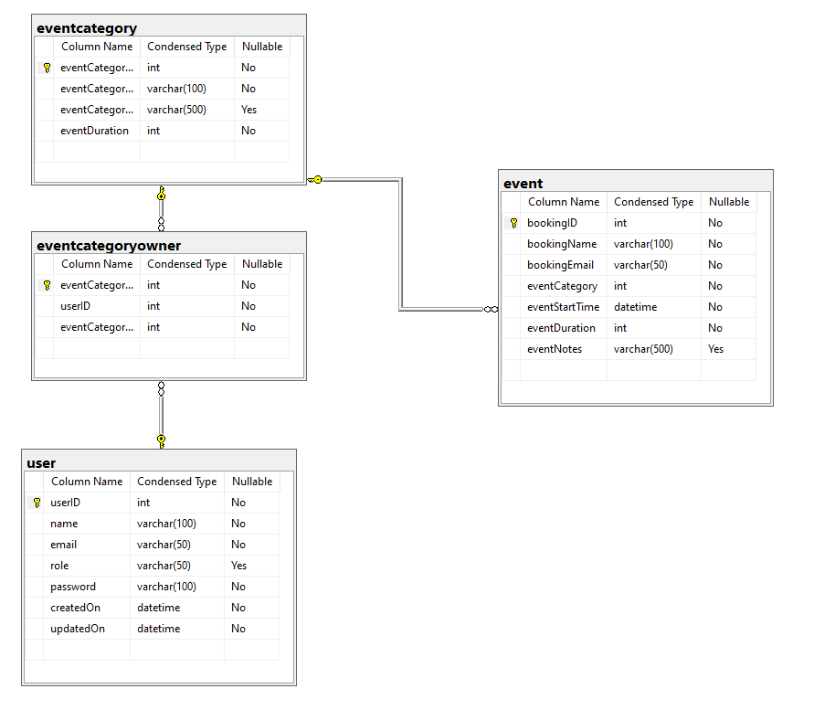

# Integrated_Project

This project is part of INT221 Information Technology Integrated Project I and INT222 Information Technology Integrated Project II. It is the project from infrastructure, backend and frontend as a part together. Each sprint, the teacher will give us 2-3 PBIs to do. The topic of this project is Online Appointment Scheduling System for Integrated Project (OASIP). You can book events to meet teachers in each clinic to consult or report any problems.

## OASIP ER Diagram

Database Code: [OASIP_Database](./OASIP_Database.sql)
